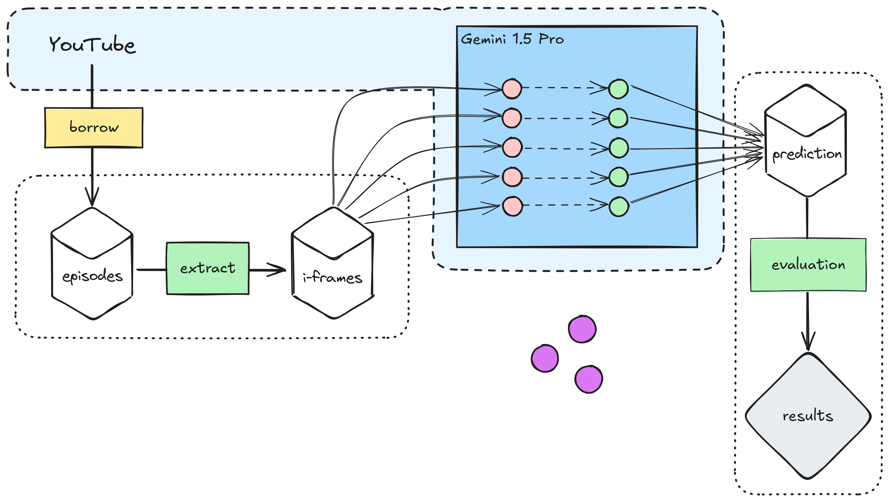

# Buurman & Buurman deep dive

Buurman & Buurman, or [Pat & Mat](https://en.wikipedia.org/wiki/Pat_%26_Mat), is an animated series from Czechoslovakia that was aired almost in its entirety in The Netherlands as well, where Kees Prins and Siem van Leeuwen added voices to the two characters.

This repository contains the haphazard scripts and data I created for a *Powerpoint Party* with friends.
I ask the question: **Which neighbor, Pat or Mat, is the more important one?**
And I try to reason my way to an answer by extracting frames from (almost) all of their episodes to count how often Pat and Mat appear individually.
The counting is done by Gemini 1.5 Pro using batch predictions.

See the [slides](Buurman%20en%20Buurman%20en%20ik.pdf).

## System diagam

